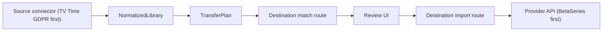

# Architecture

SagaLog keeps source exports, provider APIs, and transfer behavior behind explicit interfaces. The first implemented route is TV Time GDPR export to BetaSeries, but the intended model is any supported source to any supported destination.

## Domain

`core/domain/media.ts` contains the normalized objects:

- `WatchedEpisode`
- `ShowListItem`
- `WatchedMovie`
- `MovieListItem`
- `NormalizedLibrary`

`core/domain/migration.ts` contains provider-agnostic migration contracts:

- `ProviderCapabilities`
- `TransferOperation`
- `ProviderShowMatch`
- `ProviderMovieMatch`
- `ImportResultLine`

## Application

`core/application/build-transfer-plan.ts` converts a normalized library into operations based on the selected provider's capabilities. This is where provider differences are handled without leaking provider-specific API details into parsing.

## Ports

`core/ports/media-provider.ts` defines the provider adapter contract. A new provider should implement:

- matching shows and movies;
- translating provider IDs into import operations;
- importing watched/list state using that provider's API.

## Infrastructure

`infra/sources/tvtime-gdpr-reader.ts` is the first source adapter. It reads the TV Time ZIP in-browser and normalizes selected CSV rows.

`server/utils/betaseries-provider.ts` is the first destination provider adapter. It owns BetaSeries-specific endpoints, fields, and import parameters.

## Direction Model

Every connector should be evaluated independently for source and destination capability:

- source capability means it can read an export or API and return `NormalizedLibrary`;
- destination capability means it can match normalized media and import operations;
- bidirectional capability means the same provider can do both.

The transfer flow should stay provider-neutral after normalization. Provider-specific semantics belong inside adapters, not the parser, UI, or transfer-plan builder.

## Extension Path

To add Trakt, Simkl, or another service as a destination:

1. Add a provider adapter in `server/utils`.
2. Add `/server/api/providers/<provider>` auth, match, and import routes.
3. Register the provider in `/server/api/providers/index.get.ts`.
4. Map its capabilities so the same transfer UI can hide unsupported operations.

To add a provider as a source, add a source reader that returns `NormalizedLibrary`. If that provider also supports writes, add the destination adapter separately so the same service can participate in either direction.
